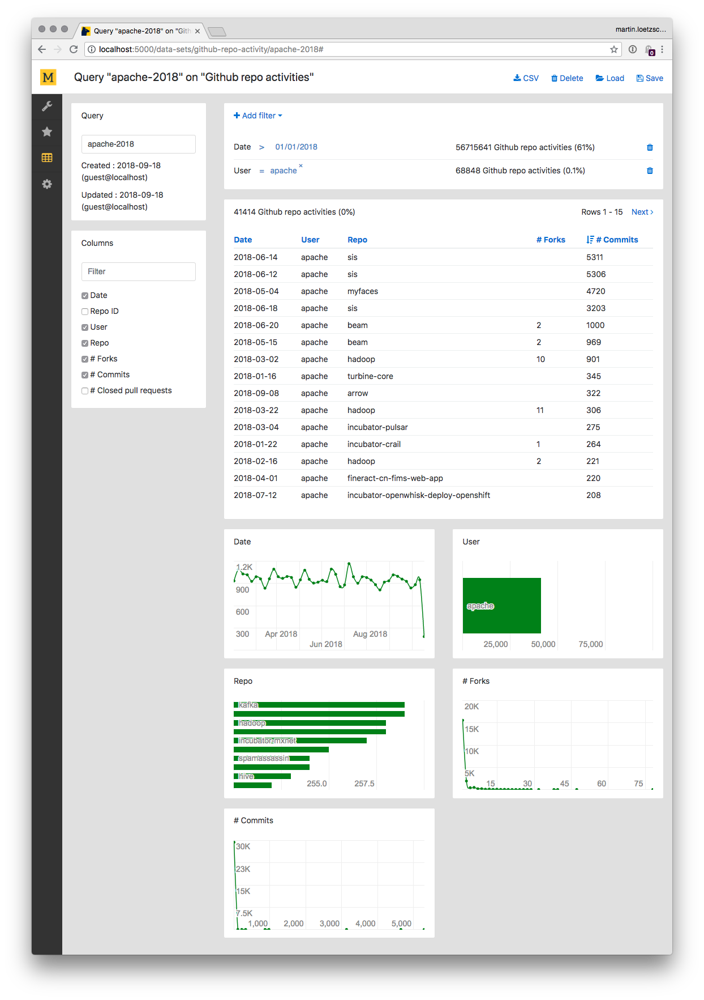

# Mara Data Sets

A minimal Flask based UI for providing raw data access to analysts, data scientists and power users of a data warehouse. Allows segmentations based on single columns of a flat table with quick data exploration, distribution charts and CSV downloads.

&bnsp;

## Visualizing fact tables

No matter how powerful the reporting frontend of a data warehouse, many users want to have direct access to raw data without having to use SQL on the database directly. This can be 

- BI product managers debugging data problems, 
- analysts needing raw data for their Excel data analysis, 
- machine learning engineers needing data sets for training models
- marketeers wanting to integrate with 3rd party data platforms

&nbsp;

This is an example of a flat table `gh_dim.repo_activity_data_set` from the [mara example project](https://github.com/mara/mara-example-project):

```
example_project_dwh=#  select * from gh_dim.repo_activity_data_set order by random() limit 10;
    Date    | Repo ID  |       User        |       Repo       | # Forks | # Commits | # Closed pull requests 
------------+----------+-------------------+------------------+---------+-----------+------------------------
 2018-05-12 | 8986340  | superchen14       | leetcode         |         |         1 |                       
 2018-01-05 | 17938434 | TSSSaver          | tsschecker       |       1 |           |                       
 2018-04-07 | 1091327  | MichaelStedman    | HelloWorldC      |         |         1 |                       
 2018-07-27 | 22000869 | zhangjiuyang1993  | zjy-redis-demo   |         |         1 |                       
 2018-05-08 | 17099521 | jakqui            | TurboERP_backend |         |         1 |                       
 2018-05-10 | 18963607 | rakesh9700        | KTJ-ASSGNMNT-1   |       1 |           |                      2
 2018-02-14 | 4536360  | OpenConext        | Stepup-Deploy    |         |         2 |                       
 2017-08-19 | 17837190 | EspeonOfEspeonage | e621bot          |         |         5 |                      2
 2017-12-27 | 2219655  | kairen            | ikm-ansible      |         |         2 |                       
 2017-08-15 | 6375048  | irying            | c-notes          |         |         1 |                       
(10 rows)
```

This is that table viewed through the data sets UI:



In the top right panel, arbitrary filters on date, text and numeric columns can be defined and their individual selectivity on the whole data set is shown. In the preview panel below, users can browse through individual rows. Output columns can be selected in the panel on the left, sorting is done by clicking on column headers, and individual cell values can be clicked for filtering the data set. Below the preview panel, the distributions of the selected columns across the data set and considering the current filters is shown.  

Combinations of filters can be saved as a query for later reference. And queries can be downloaded to CSV for further processing in any other tool.

&nbsp;

## Integrating and configuring data sets

See the [mara example project](https://github.com/mara/mara-example-project) for how to integrate this feature into a Flask application. Individual data set tables are configured like this (see [app/data_sets.py](https://github.com/mara/mara-example-project/blob/master/app/data_sets.py)):

```python
import data_sets.config
import data_sets.data_set
from mara_app.monkey_patch import patch


@patch(data_sets.config.data_sets)
def _data_sets():
    return [
        data_sets.data_set.DataSet(
            id='github-repo-activity', name='Github repo activities',
            database_alias='dwh', database_schema='gh_dim', database_table='repo_activity_data_set',
            default_column_names=['Date', 'User', 'Repo',
                                  '# Forks', '# Commits', '# Closed pull requests'],
            use_attributes_table=True),
        
        # .. more data sets

    ]
```

